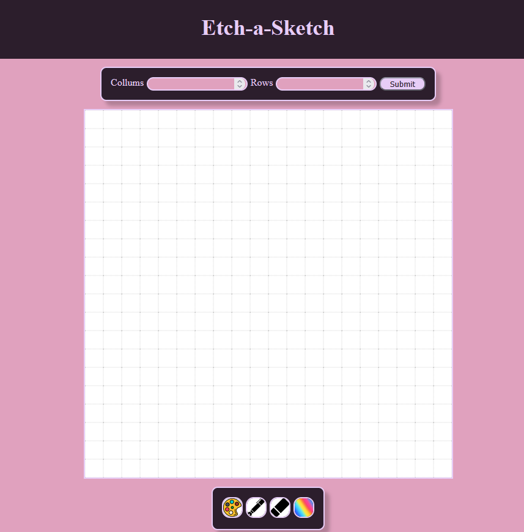

# Etch-a-Sketch

🎨 [Live Preview](https://stathiskourtis.github.io/Etch-a-Sketch/)

Etch-a-Sketch page for The Odin Project.

## Features

- Build a grid canvas.
- Pick a color.
- Use drawing tools:
  - 🖌️ **Brush**
  - 🧽 **Eraser**
  - 🌈 **Rainbow** (random color per grid drawn)
